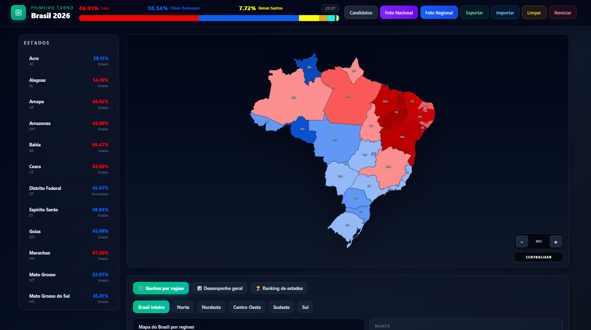
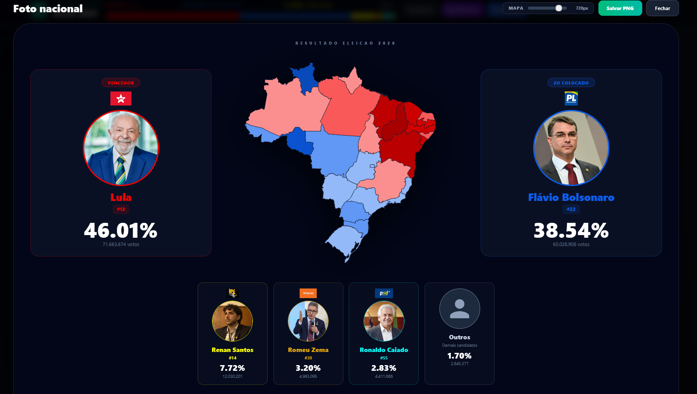
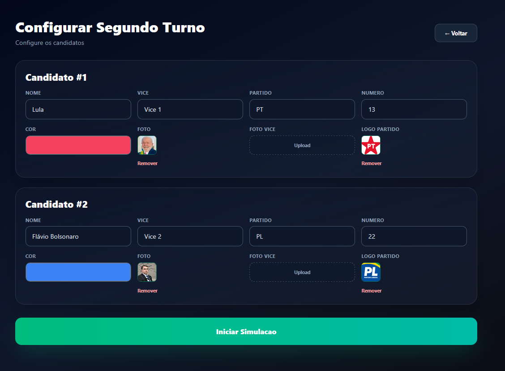
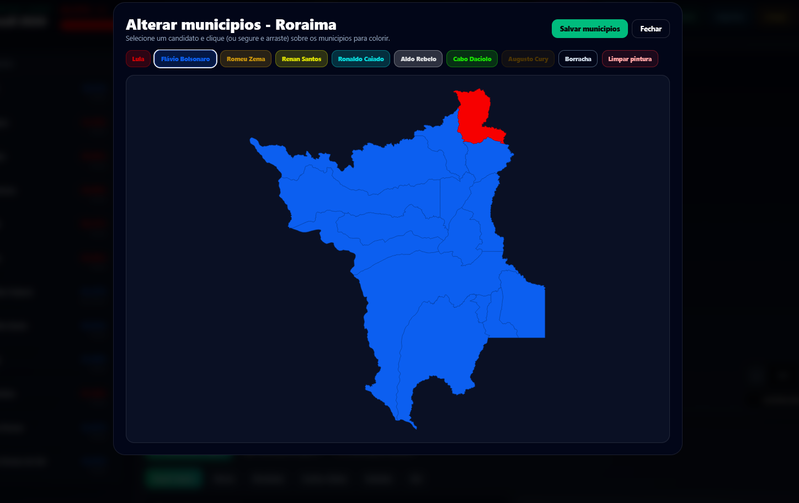

<h2>Simulador Eleitoral - Eleições Presidenciais Brasil 2026</h2>
  
  

Aplicação web interativa para simular resultados eleitorais, permitindo configurar candidatos, definir votações por estado/município e gerar imagens de resultados em alta qualidade.

<h3>Principais funcionalidades:</h3>
<ul>
  <li>Configuração de primeiro ou segundo turno com cadastro completo de candidatos (nome, vice, partido, número, cores e upload de fotos)</li>
  <li>Mapa interativo do Brasil com zoom, arrasto e efeito neon ao passar o mouse</li>
  <li>Edição de porcentagens de votos por estado via sliders, com visualização em tempo real do mapa estadual</li>
  <li>Pintura manual de municípios por estado (preenchimento por candidato ou borracha)</li>
  <li>Geração de “fotos” (PNG) dos resultados: nacionais, por estado e por região (com opção de visualização por município)</li>
  <li>Estatísticas detalhadas: ganhos por região, desempenho geral dos candidatos e ranking de estados</li>
  <li>Exportação e importação de cenários em JSON</li>
  <li>Design responsivo, animações fluidas e suporte a temas escuros</li>
</ul>

<h3>Tecnologias utilizadas:</h3>
<ul>
  <li>React com TypeScript</li>
  <li>Vite (build tool)</li>
  <li>Framer Motion (animações)</li>
  <li>D3-geo (projeções cartográficas)</li>
  <li>html2canvas (captura de tela para geração de imagens)</li>
  <li>Tailwind CSS (estilização e responsividade)</li>
  <li>GeoJSON de estados e municípios brasileiros (IBGE / GitHub)</li>
</ul>

O projeto demonstra técnicas avançadas de visualização de dados geográficos, manipulação de estado complexo, upload de imagens em base64, interações com mapas e geração de artefatos para download.

<h3>Pré-visualização da interface:</h3>

  
  

Desenvolvido como ferramenta de simulação eleitoral - Contribuições são bem-vindas!

